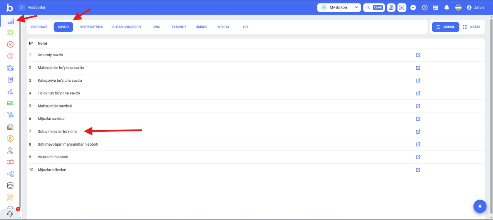

# Sales Reports

Overall Sales

<figure><figcaption></figcaption></figure>

The **Overall Sales** page is designed for general analysis of sales indicators based on selected filters. All data on the page is automatically updated depending on active filters.

The top section displays key financial indicators:

* **Sold** — total sales amount for the selected period and filter.
* **Returned** — total amount of returned products.
* **Discount** — total amount of discounts given.
* **Revenue** — net income, taking returns into account.
* **Gross Profit** — net profit (result after cost deduction).

<figure><figcaption></figcaption></figure>

**Chart**

Below the indicators is a chart (diagram) that visually displays the above data. The user can change the chart type:

* Column chart
* Line chart

<figure><figcaption></figcaption></figure> <figure><figcaption></figcaption></figure>

**Sales List**

In the lower part of the page, all sales are presented in table format. The table is also formed according to active filters and allows for detailed analysis.

This page serves to view sales volume, returns, discounts, and profit indicators in one place and to make quick management decisions.

<figure><figcaption></figcaption></figure>

Sales by Products

<figure><figcaption></figcaption></figure>

The **Sales by Products** page is designed to analyze sales indicators by product based on selected filters. All data is formed depending on active filters.&#x20;

\
**Top Section**

On the left side of the page is the **Top 5 Products** block, showing the best-selling products and their sales amounts. This block allows for quick viewing of product rankings.

On the right side is the **Product Sales Chart (diagram)**. The diagram visually displays sales dynamics by product. Each product is distinguished by different colors. The diagram updates based on the filtered date or other parameters.

(Visible only when date is selected)

<figure><figcaption></figcaption></figure>

**Main Table**

In the lower part of the page is a detailed analysis table by products. This table allows viewing sales and profit indicators in exact numbers for each product.

<figure><figcaption></figcaption></figure>

It helps determine product profitability. For example:

* Which product is selling most,
* Which product has low profit or loss,
* Which products have high returns,
* How discount and cost affect profit.

At the bottom of the table:

* **Total** — shows overall results across all products for the selected filter. This allows quick assessment of overall sales and profit situation.
* **Forecast** — estimated indicators calculated based on available data. This serves to assess future results in advance and plan accordingly.

Sales by Category

<figure><figcaption></figcaption></figure>

The **Sales by Category** report shows sales results by product categories. Through this report, you can analyze which category is selling more and which category has lower sales.

The report table displays the following information:

* **Name** — product category name
* **Quantity Sold** — total number of products sold from this category
* **Quantity Returned** — number of returned products
* **Sales** — total sales amount by category
* **Returned** — amount of returned products
* **Discount** — total discount amount given
* **Tax Included** — tax amount added to sales

If **"No Category"** is shown in the table, this means that sales data for all products not assigned to a category are accumulated in this row.

At the bottom of the table:

* **Total** — overall results for selected filters
* **Forecast** — forecast indicators calculated by the system

This report helps the business identify which product categories are generating the main revenue.

<figure><figcaption></figcaption></figure>

Sales by Payment Type

<figure><figcaption></figcaption></figure>

The **Report by Payment Type** page is designed to analyze sales by payment methods. Through this page, you can determine how much sales were made through which payment type, returns, and profit indicators.

All data is formed based on selected filters.

<figure><figcaption></figcaption></figure>

**What does the report show?**

This page allows analyzing:

* Which payment type is used more
* The share of cash and terminal sales
* Effectiveness of online payment systems
* Volume of debt (credit sales)
* Profit level by each payment type

Product Sales

<figure><figcaption></figcaption></figure>

The **Product Sales Report** page shows each sales transaction in detail by product. Through this report, it's clear which customer bought which product, when, in what quantity, and at what price.

This section is important for analyzing sales profitability. For example:

* Which sale was more profitable
* Which product is generating less profit
* How discount and cost affect profit
* Determining sales activity in a specific time period.

The first part of the table contains the following columns:

* **Customer** — person or organization who purchased the product.
* **Product** — name of product sold.
* **Category** — product group.
* **Unit of Measurement** — product's unit of sale (kg, liter, piece, etc.).
* **Sales Number** — sales document number (can click to open document).
* **Status** — status of sales process (Completed, etc.).
* **Quantity** — volume of product sold.
* **Price** — unit price.
* **Discount** — discount amount applied in sale.
* **Tax Included / Tax Added** — tax indicators.
* **Total Price** — total sales amount of sold product.
* **Total Cost** — total cost of sold products.
* **Gross Profit** — net profit from this sale.
* **Sale Time** — date and time when sale was made.

<figure><figcaption></figcaption></figure>

Customer Sales

<figure><figcaption></figcaption></figure>

The **Customer Sales** page is designed to display all sales made by the selected customer.

Initially, when entering this report, no data appears. The report is formed only **after a customer is selected**. The selected customer's sales are displayed based on active filters (date, organization, and other parameters).

<figure><figcaption></figcaption></figure>

**Report Purpose**

This page allows determining:

* Customer's total purchase volume
* Which products they bought more
* In which period they made active purchases
* Volume of discounts given to customer

This report is an important tool for analyzing work with customers, identifying loyal customers, and forming individual sales strategy.

Sales by Customers

<figure><figcaption></figcaption></figure>

In this report, all sales are displayed by customers. That is, in each sales transaction, it's visible which customer made the purchase, the sale date, and payment details. Through this report, you can analyze when and by what method each customer made payment.

The table displays the following information:

* **Customer** — name of customer who made the sale
* **Date** — time when sale was made
* **Price** — total value of sale
* **Cash** — amount paid by cash
* **Card** — payment by bank card
* **Terminal** — payment via POS terminal
* **Money Transfer** — payment by bank transfer
* **Debt** — amount recorded as debt
* **Click** — payment via Click
* **From Balance** — amount paid from customer balance
* **Total Payment** — total amount paid
* **Comment** — additional comment on sale

<figure><figcaption></figcaption></figure>

When the **expand button** on the left side of each sales row is pressed, the list of products sold in that sale is also displayed. It shows the following information:

* **Name** — product name
* **Quantity** — number of products sold
* **Price** — unit price of product
* **Total Price** — total amount for the product

Through this feature, you can see in detail exactly which products were sold in each customer's sale.

<figure><figcaption></figcaption></figure>

Non-Selling Products Report

<figure><figcaption></figcaption></figure>

Through the non-selling products report, you can view products that were sold little or not sold during the selected period. The report shows product name, category, unit of measurement, quantity sold, sales amount, and current warehouse balance. With this information, you can identify which products are moving slowly and make decisions about discounts, promotions, or reordering for them.

**Product Name** — name of the product.\
**Category** — shows which category or type the product belongs to.\
**Unit of Measurement** — indicates in what unit the product is counted (e.g.: piece, kg, liter).\
**Quantity** — amount of product sold during the selected period.\
**Amount** — total sales amount from this product sale.\
**Current Product Balance** — amount of product currently remaining in warehouse.

At the bottom of the table is the **Total** row, which shows the total quantity and total sales amount of all products for the selected filter.

<figure><figcaption></figcaption></figure>

Agent Report

<figure><figcaption></figcaption></figure>

Through the **Agents Report**, you can analyze the activities of agents (salespeople or representatives) who participated in the sales process. The report shows information about each agent's sales made, returned sales, discounts, and revenues. With this information, you can assess which agent is making more sales, their efficiency, and overall sales results.

**Agent** — name of agent participating in sales.\
**Sales** — total sales amount made through the agent.\
**Returned** — amount of returned products.\
**Discount** — total discount amount given during sales.\
**Revenue** — final revenue with returns and discounts taken into account.\
**Sold** — number of sales transactions made.\
**Quantity Sold** — total quantity of products sold.\
**Quantity Returned** — number of returned products.\
**Average Daily Sales** — agent's average daily sales amount.\
**Number of New Customers** — number of new customers added to the system through this agent.\
**Gross Profit** — overall profit indicator obtained through the agent.

<figure><figcaption></figcaption></figure>

Customer Payments

<figure><figcaption></figcaption></figure>

In the **Customer Payments** report, information about all payments and contracts related to customers is displayed. Through this report, you can track payments for products sold on credit, monitor customer debt, and payments made.

At the top of the report, the following indicators are displayed:

* **Total Contracts** — number of all contracts in the system and their total amount
* **Initial Payments** — initial payments made when contract was concluded
* **Overdue Payments** — debts whose payment deadline has passed but have not yet been paid
* **Payments** — amount of all payments made by customers
* **Expected Payments** — amounts that have not yet reached their payment deadline but need to be paid in the future
* **Completed Contracts** — contracts that have been fully paid and closed

<figure><figcaption></figcaption></figure>

The lower table section shows detailed information for each contract:

* **Number** — contract or sales number
* **Customer** — customer making the payment
* **To Be Paid** — total amount that needs to be paid
* **Paid** — amount paid so far
* **Initial Payment** — payment made initially
* **Responsible Person** — employee responsible for the sale or contract
* **Date** — contract or sales date

This report allows managing not only products sold on credit, but all customer payments. Even if the sale is not on credit, it will be reflected in the **contract**, **initial payment**, **payments**, and **completed contracts** sections. Through this, all customer payments can be controlled in one place.

