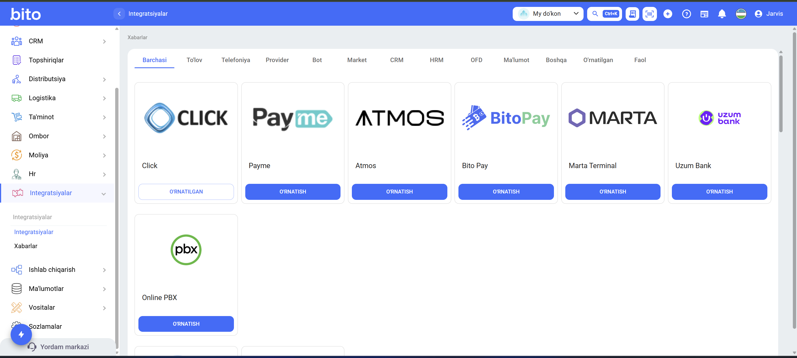

# Интеграции

### Интеграции

Раздел интеграций позволяет связывать систему с внешними сервисами и платформами. Через этот раздел настраивается интеграция с платежными системами, банками, телефонией и другими сервисами, что позволяет управлять всеми процессами в единой системе.\
Этот раздел используется для автоматизации бизнес-процессов, ускорения обмена данными и подключения дополнительных сервисов к системе.

<figure><figcaption></figcaption></figure>

Для подключения необходимо перейти в раздел Интеграции → Интеграции, выбрать нужный сервис и активировать интеграцию через кнопку **"Установить"**. Для некоторых интеграций могут потребоваться API-ключи или дополнительные настройки.

В этом разделе все интеграции отображаются в виде карточек (card). Через каждую карточку можно просматривать статус интеграции и управлять ею.

Доступные интеграции разделены по категориям:

* Платежные системы (Click, Payme, BITO Pay и другие)
* Банковские и терминальные сервисы (Uzum Bank, Marta Terminal)
* Телефония (Online PBX)
* Другие сервисы (CRM, HRM, OFD и т.д.)

Для каждой интеграции доступны следующие возможности:

* Установка или отключение интеграции
* Просмотр статуса (установлена / не установлена)
* Управление настройками
* Обмен данными с системой в режиме реального времени

Через этот раздел можно автоматизировать прием платежей, синхронизироваться с внешними системами и ускорять операции.

